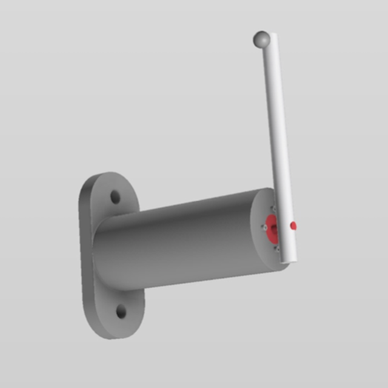
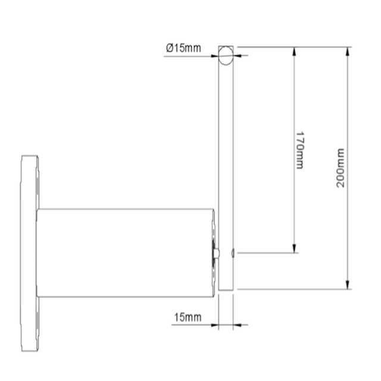

# Take Home - Ball Launcher Simulator

## Background

We would like your assistance creating a simulation software for a new product: a ball launcher. Please see the adjacent images for a rendering and 2d orthographic schematic drawing of our ball launcher concept.

 

### Spec
The ball launcher operates by electromagnetically holding the ball in place until it is released. 
- The ball is held in firmly in place electromagnetically and **can be released at any time**.
- The motor that drives the arm can apply a torque up to **2 NM until a maximum speed of 20 radians per second is reached**.
- The cylinder is made of **6061 aluminum alloy** and the ball is made of **solid 1018 steel**
- You can assume the weight of electronics and wiring is negligible.

## Your Simulator

Your simulator should:
- **Assist the Software Team**: Enable the software team to determine the optimal parameters for launching the ball to achieve specific travel distances. This involves modeling launch distances as a function of the starting angle, motor torque, and ball release angle.
- **Assist the Hardware Team**: Allow the hardware team to experiment with different motor configurations by testing various possibilities for the motor’s torque and maximum speed. This exploration will provide insights into how these values affect the ball’s maximum travel distance and overall performance.

You can use any programming language for this project and leverage any open-source libraries or third-party tools that may aid in completing the task. However, please refrain from delivering a solution built entirely in systems engineering software like Labview or Simulink; we want to review your code not someone else's creation.

Please ensure your simulator includes a user-friendly interface that enables interaction. This interface should also render and graphically show the user the live simulation. This task is intentionally open-ended, allowing you to determine the most appropriate outputs for the project. Consider the team's goal of creating the best possible ball launcher when deciding on the outputs. Additionally, if you have ideas for further development of the simulator, please share them with your submission.

## Timeline

Aim to complete and submit the project within a week. If you have any time constraints, please inform us in advance.

```
Hint: If you need to refresh your knowledge of high school physics, resources like Khan Academy can be helpful. You can also reach out to ChatGPT for assistance. Remember, the goal is not to specifically measure your physics ability but to assess your problem-solving and coding skills.
```

## Submission

Please upload your solution to a private Google Drive folder and share the folder's URL with us. In your README file, include a link to a short (1-2 minutes) screen recording of your solution. Upload the screen recording to the folder along with your code. 

**Note**:
- Your Readme must include instructions on how to setup and run the simulator. This also includes any commands required to install dependencies.
- Each test is unique to you, any attempts to copy or redistribute this test will result in immediate disqualification. 

Good luck with your project, and we look forward to reviewing your submission!

```
We encourage the use of GenAI at work for both learning and implementation. Please feel free to use LLMs, GitHub CoPilot, etc.
However please explain your work when you complete the README notes.
```